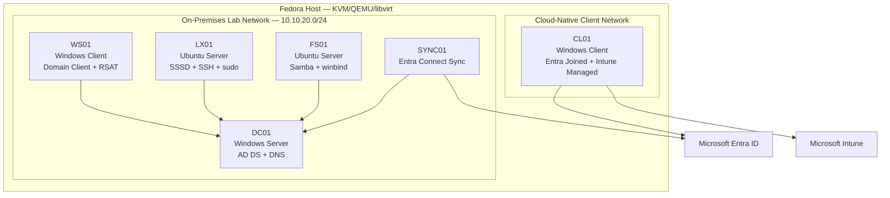

# Hybrid Identity Platform

A four-stage infrastructure engineering portfolio demonstrating centralized identity, Linux integration, cloud-managed endpoints, and controlled hybrid identity.

## Executive Summary

This repository documents the design and implementation of a compact hybrid identity platform for a fictional distributed business unit.

The goal is not to simulate a large enterprise or collect disconnected tutorials. The goal is to demonstrate how identity, access control, endpoint management, Linux integration, networking, security, troubleshooting, and hybrid architecture work together to solve a real business problem.

The platform follows a phased modernization model:

```text
Fragmented access
      ↓
Centralized identity
      ↓
Cross-platform access control
      ↓
Cloud-managed endpoints
      ↓
Controlled hybrid identity
```

The main engineering message is simple:

> A company does not need to replace everything at once to modernize identity. It can first establish centralized access, extend that identity to Linux, govern remote endpoints through the cloud, and then connect the on-premises and cloud identity planes through a controlled hybrid bridge.

---

## Business Problem

The fictional organization, **Falkenwerk International**, has a regional business unit with typical infrastructure problems:

* user accounts are managed inconsistently;
* Windows and Linux access are separated;
* administrative rights are broader than necessary;
* workstation configuration is not centrally enforced;
* remote devices cannot depend on office connectivity;
* onboarding and offboarding require manual work in several systems;
* troubleshooting is reactive and based on assumptions;
* modernization must happen without a disruptive big-bang migration.

This repository demonstrates a staged solution to those problems.

---

## Architecture Overview

The platform is built as four linked, independently finishable projects.

| Project                  | Purpose                                                                      | Main Technologies                                                |
| ------------------------ | ---------------------------------------------------------------------------- | ---------------------------------------------------------------- |
| 01 — Identity Foundation | Centralize Windows identity, DNS, policy, delegation, and controlled access  | Windows Server, Active Directory, DNS, Group Policy              |
| 02 — Linux Integration   | Extend the same identity model to Linux login and Linux-hosted file services | Ubuntu Server, SSSD, Kerberos, Samba, winbind                    |
| 03 — Endpoint Management | Manage cloud-native Windows endpoints without office connectivity            | Microsoft Entra ID, Intune, Compliance, LAPS, Conditional Access |
| 04 — Hybrid Identity     | Connect on-premises identity with the Microsoft cloud control plane          | Microsoft Entra Connect Sync, Hybrid Join, UPN strategy          |

The projects are connected by the same identity and access story:

```text
Project 1 creates users, groups, DNS, policy, and access roles.
Project 2 reuses those identities and groups on Linux.
Project 3 creates the cloud identity and endpoint-management plane.
Project 4 connects the on-premises and cloud identity planes.
```

---

## Reference Architecture



---

## Repository Structure

```text
hybrid-identity-platform/
├── README.md
├── Lab-Backlog.md
├── architecture/
│   └── platform-overview.md
├── decisions/
│   └── adr-000-scope-and-sequencing.md
├── 01-identity-foundation/
│   ├── README.md
│   ├── architecture/
│   ├── configs/
│   ├── decisions/
│   ├── docs/
│   ├── evidence/
│   └── incidents/
├── 02-linux-integration/
│   ├── README.md
│   ├── architecture/
│   ├── configs/
│   ├── decisions/
│   ├── docs/
│   ├── evidence/
│   └── incidents/
├── 03-endpoint-management/
│   ├── README.md
│   ├── architecture/
│   ├── configs/
│   ├── decisions/
│   ├── docs/
│   ├── evidence/
│   └── incidents/
└── 04-hybrid-identity/
    ├── README.md
    ├── architecture/
    ├── configs/
    ├── decisions/
    ├── docs/
    ├── evidence/
    └── incidents/
```

---

## Design Principles

This lab is built around engineering principles rather than product worship.

Core principles:

* Solve business problems, not technology puzzles.
* Lead with the problem before the solution.
* Think in systems, not isolated components.
* Identity is the security perimeter.
* Apply least privilege by default.
* Deny by default and grant explicitly.
* Capture baselines before troubleshooting.
* Use evidence instead of assumptions.
* Design for recovery, not only uptime.
* Document decisions, incidents, and production gaps.
* Keep secrets out of Git.

---

## Project 1 — Identity Foundation

### Business Question

How can the business unit centralize employee identity, enforce workstation policy, delegate routine administration, and control resource access without giving broad administrative rights?

### Scope

This project builds the on-premises identity foundation:

* Active Directory forest and domain;
* AD-integrated DNS;
* Windows client domain join;
* users, groups, and organizational units;
* Group Policy;
* delegated password reset;
* group-based access control;
* authentication versus authorization;
* incident diagnosis and recovery.

### Expected Outcome

A user can authenticate through centralized identity, receive policy based on scope, access only authorized resources, and routine support tasks can be delegated without Domain Admin rights.

---

## Project 2 — Linux Integration

### Business Question

How can Linux interactive access and Linux-hosted file services use the same Active Directory identities and role groups without maintaining separate account databases?

### Scope

This project separates two Linux identity roles:

```text
LX01
SSSD + PAM + NSS
Purpose: interactive Linux identity, SSH, sudo

FS01
Samba + winbind + rid
Purpose: SMB file service for AD users and groups
```

Included capabilities:

* Ubuntu Server baseline;
* DNS, time, and Kerberos validation;
* SSSD-based AD login;
* AD-group-controlled SSH and sudo;
* Samba member server with winbind;
* deterministic `rid` identity mapping;
* Windows access to Linux-hosted SMB shares;
* packet and log analysis;
* controlled failures and recovery.

### Expected Outcome

The same Active Directory identities and role groups control both Linux login and Linux-hosted file access, while the implementation respects supported Linux identity-stack boundaries.

---

## Project 3 — Endpoint Management

### Business Question

How can remote Windows devices be securely enrolled, configured, and governed without office connectivity or hands-on IT provisioning?

### Scope

This project builds the cloud endpoint-management plane:

* Microsoft Entra tenant;
* cloud-only emergency access accounts;
* Entra-joined Windows endpoint;
* Intune enrollment;
* configuration profiles;
* Windows LAPS;
* compliance policy;
* Conditional Access;
* application deployment;
* sign-in and audit evidence.

### Expected Outcome

A cloud-native Windows endpoint is managed through Intune, evaluated for compliance, and granted or denied access based on both identity and device state.

---

## Project 4 — Hybrid Identity

### Business Question

How can the organization connect the established on-premises identity environment to cloud services while controlling migration scope and avoiding a big-bang replacement?

### Scope

This project connects the identity planes:

* namespace and UPN strategy;
* synchronization scope;
* selected-user synchronization;
* source-of-authority validation;
* Microsoft Entra hybrid join;
* lifecycle-change testing;
* synchronization failure and recovery.

### Expected Outcome

Selected on-premises identities become visible in the Microsoft cloud control plane while scope, ownership, privileged accounts, and migration boundaries remain controlled.

---

## Evidence Standard

This repository does not treat screenshots as decoration.

Evidence must prove behavior.

Each major capability should include:

```text
normal baseline
successful result
expected denial or failure
diagnostic chain
recovery validation
business relevance
```

Examples:

| Capability               | Success Evidence                          | Denial / Failure Evidence                   | Business Value                     |
| ------------------------ | ----------------------------------------- | ------------------------------------------- | ---------------------------------- |
| Delegated password reset | Helpdesk resets Engineering user password | Helpdesk cannot reset Finance user password | Support without broad admin rights |
| Linux AD login           | AD user logs into LX01                    | Unauthorized user denied                    | Central identity across platforms  |
| Conditional Access       | Compliant device gains access             | Non-compliant device blocked                | Device state controls access       |
| Hybrid sync              | Selected user appears in Entra ID         | Out-of-scope user does not sync             | Controlled migration boundary      |

---

## Incident and Recovery Standard

Every project includes controlled failure drills.

The diagnosis path follows the dependency chain:

```text
virtual link
→ IP addressing and routing
→ DNS
→ time
→ authentication
→ authorization
→ service
→ application
```

The required incident flow is:

```text
predict
→ break
→ observe
→ diagnose
→ localize
→ repair
→ validate
→ document
```

The goal is not only to fix problems. The goal is to understand where the failure occurred and how recovery was proven.

---

## Production Considerations

This is a lab portfolio, not a production deployment.

The lab may demonstrate:

* centralized identity;
* controlled access;
* delegated administration;
* Linux integration;
* endpoint governance;
* Conditional Access;
* hybrid identity;
* evidence-based troubleshooting;
* recovery validation.

The lab does not claim:

* enterprise scale;
* high availability;
* full disaster recovery;
* regulatory compliance certification;
* production readiness;
* real cost savings.

A production deployment would additionally require:

* redundant domain controllers and DNS;
* backup and tested restore;
* monitoring and alerting;
* privileged access model;
* patch management;
* configuration management;
* staged rollout rings;
* license and cost governance;
* synchronization monitoring;
* change control;
* security baselines;
* documented operational ownership.

---

## Skills Demonstrated

### Infrastructure

* Windows Server administration
* Active Directory Domain Services
* DNS and name resolution
* Group Policy
* Linux administration
* KVM/QEMU/libvirt virtualization
* Network troubleshooting

### Identity and Access

* Authentication versus authorization
* OU design versus group membership
* Role-based access control
* Delegated administration
* Kerberos prerequisites
* Linux identity integration
* Cloud identity synchronization

### Endpoint and Cloud

* Microsoft Entra ID
* Microsoft Intune
* Device compliance
* Conditional Access
* Windows LAPS
* Hybrid identity design

### Security and Operations

* Least privilege
* Default deny
* Zero Trust principles
* Secret handling
* Evidence-based troubleshooting
* Incident documentation
* Recovery validation
* Architecture Decision Records

---

## Current Status

```text
Phase 0: Foundation
Status: In progress
```

Completed:

* Fedora virtualization baseline
* Git configuration
* GitHub SSH authentication
* VS Code workspace
* Repository structure
* GitHub profile repository

Current work:

* root README
* platform architecture document
* scope and sequencing ADR
* lab backlog
* libvirt `adlab` network

Next major technical milestone:

```text
Build DC01
Create Active Directory domain
Prove DNS-based domain controller discovery
```

---

## Portfolio Goal

The final portfolio should make one conclusion clear:

> This is not a collection of tools. It is a business-driven hybrid infrastructure platform that shows how identity, access, endpoints, Linux integration, cloud control planes, troubleshooting, documentation, and recovery fit together.

The target roles include:

* Infrastructure Engineer
* Systems Engineer
* Identity and Access Administrator
* Endpoint Engineer
* Modern Workplace Engineer
* Cloud Operations Engineer
* Hybrid Infrastructure Engineer
* Platform Operations Engineer

---

## License and Safety Notes

This repository is for learning, demonstration, and portfolio purposes.

It must not contain:

* passwords;
* private keys;
* tenant secrets;
* product keys;
* recovery keys;
* LAPS passwords;
* personal employee data;
* unredacted screenshots with sensitive information;
* employer or customer data.

Any secret committed once must be treated as compromised.

---
